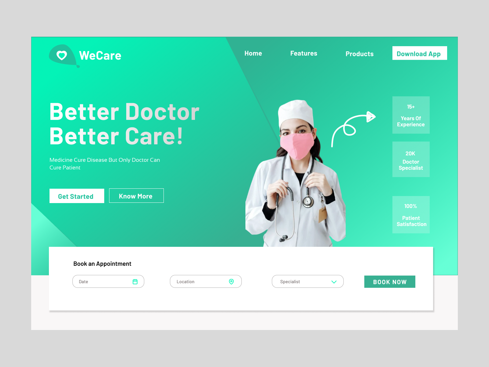
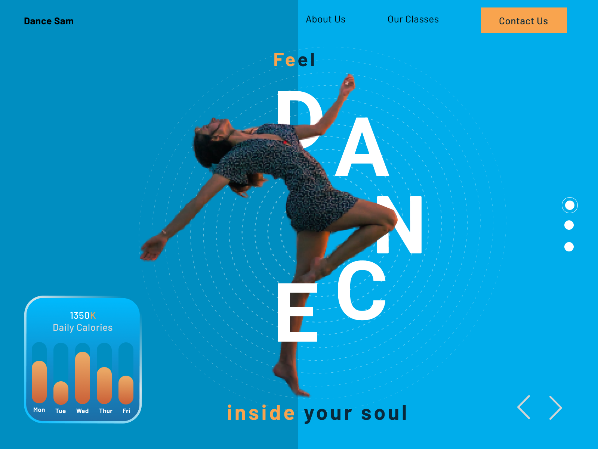
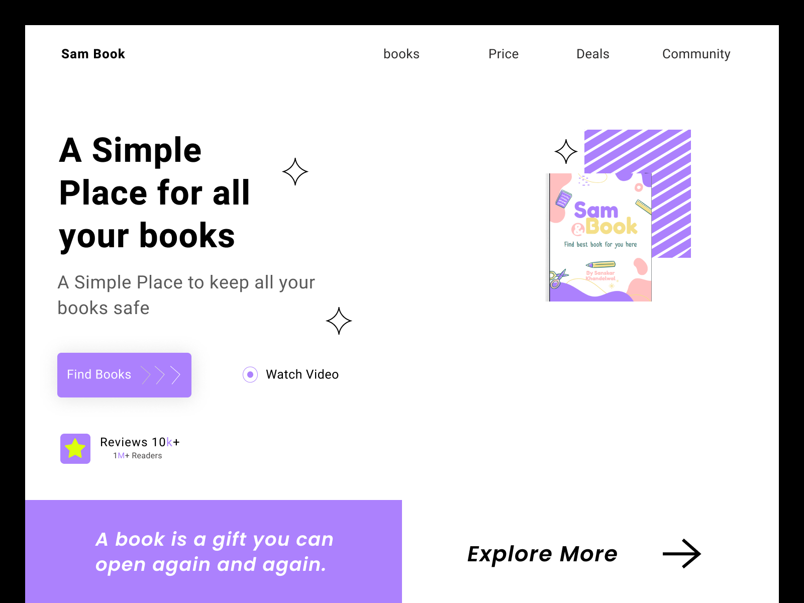
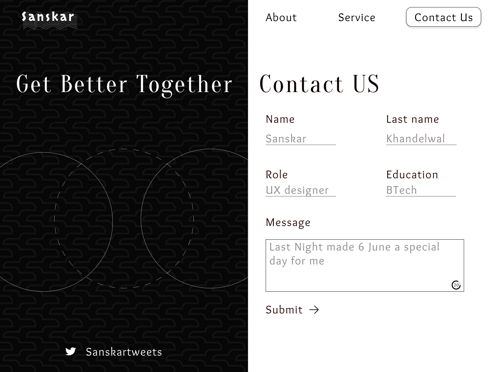
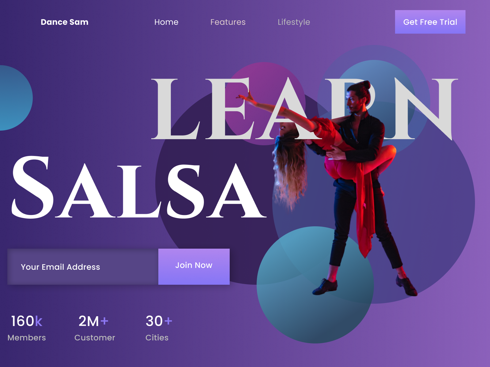
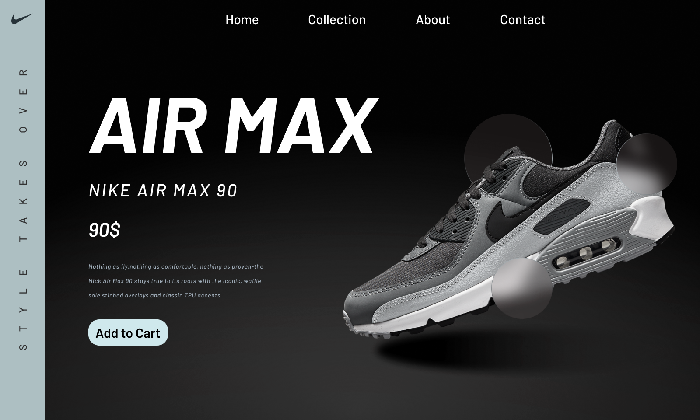
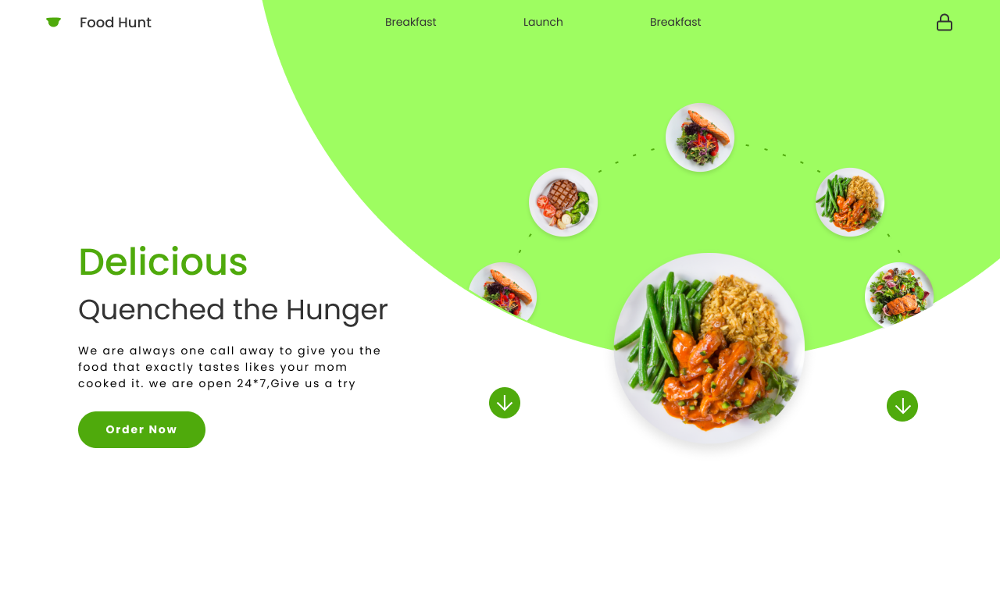
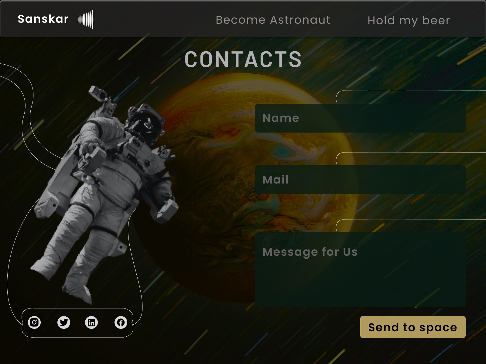
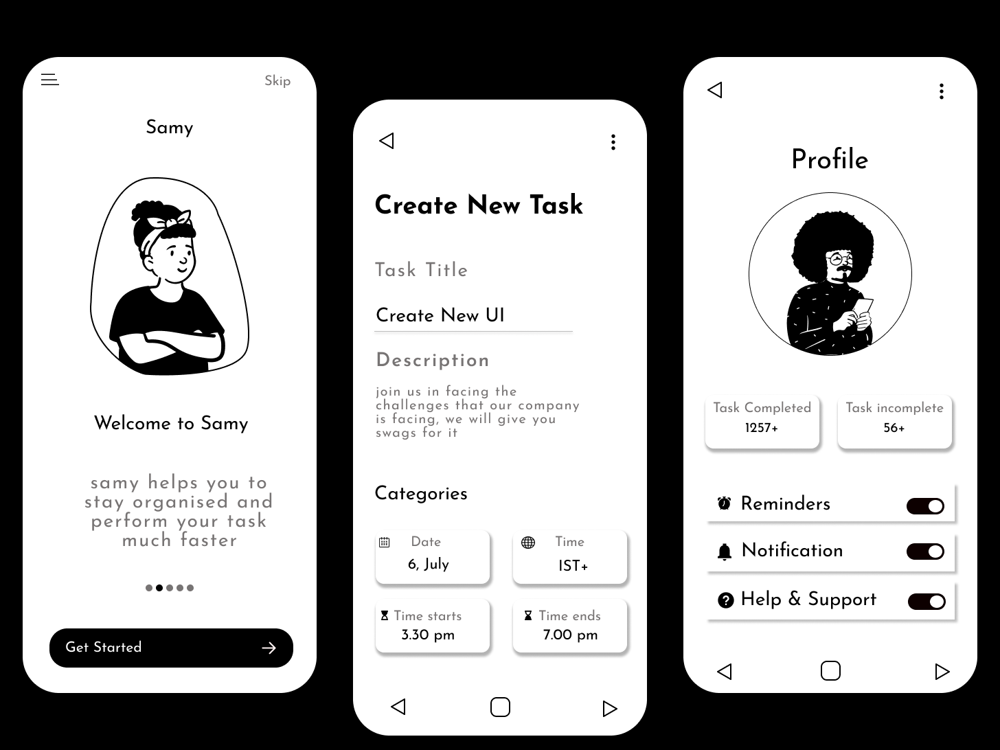
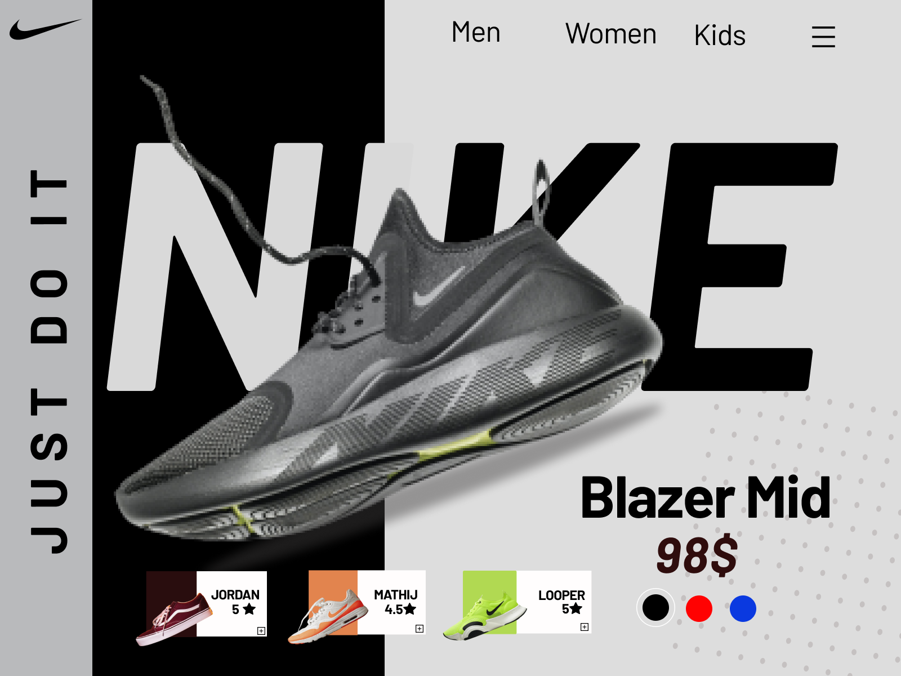

# Figma-UI-Design
It is the collection of all the UX design that I made using figma, You can use this Designs as a inspiration.

### ⚡ All Figma Design ⚡

#### I created this repository for all my designs in one place. You can download them use them share them if you want.

---

## Figma Resume

### 1. Resume

** All Figma designs in one frame **

---

### Doctor

---

### Dance

---

### Book

---

### Contact

---

### Dance

---

### Shoes

---

### Food

---

### Astronaut

---

### Mobile Notion 

---

### Shoes

---
License:-

- You can download it & use it anytime you want.
- You can share it anywhere but add a small credit to me.
- Thanks for the support. 💜
